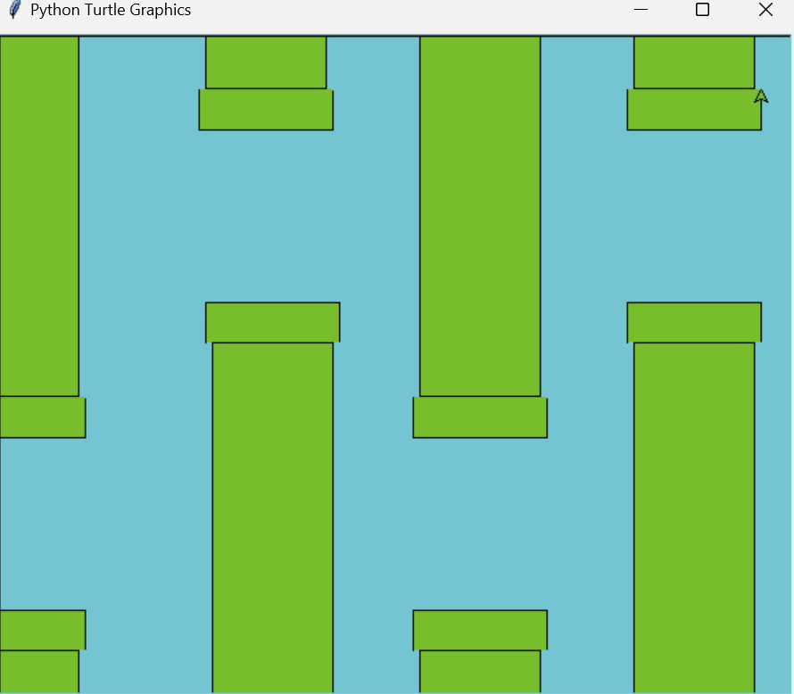
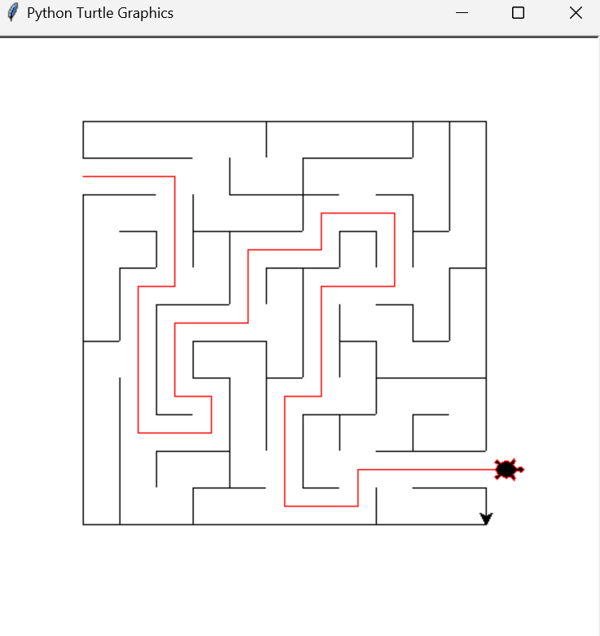
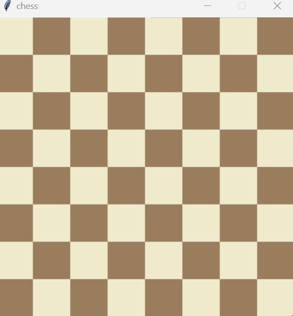
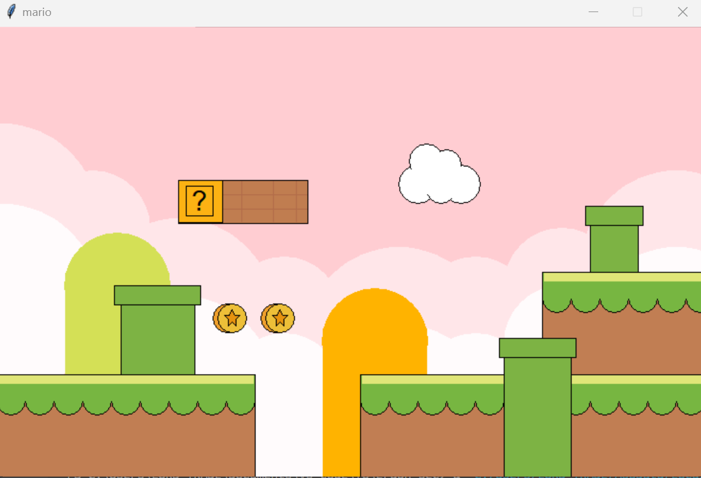
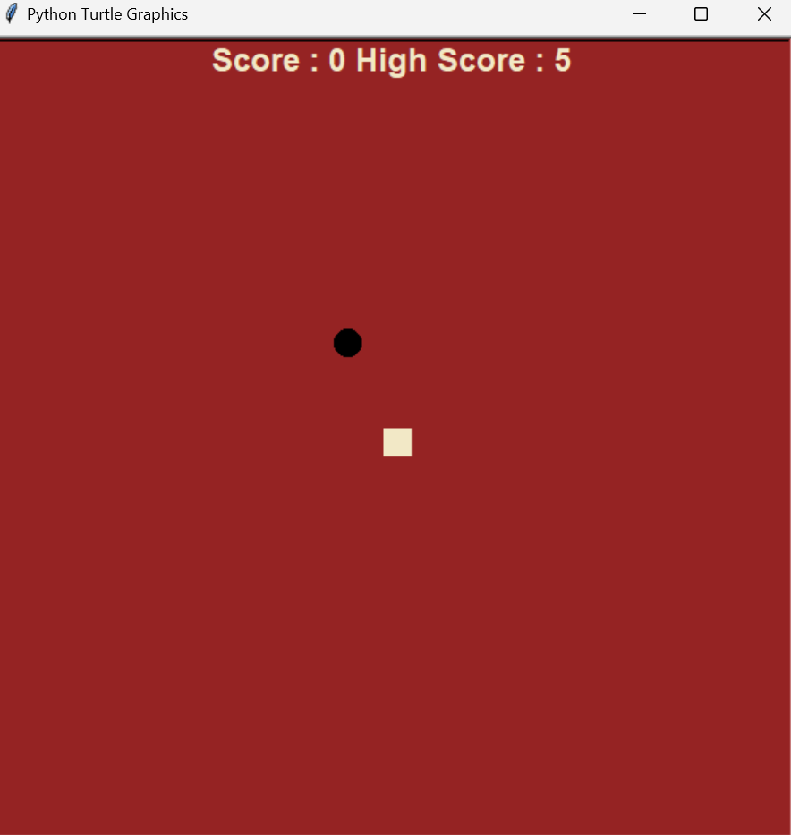
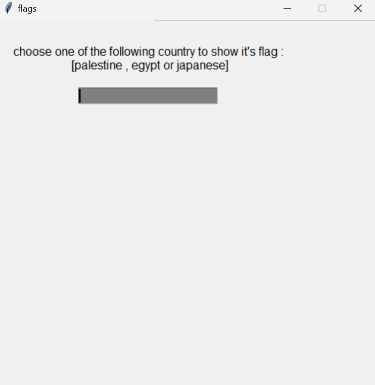
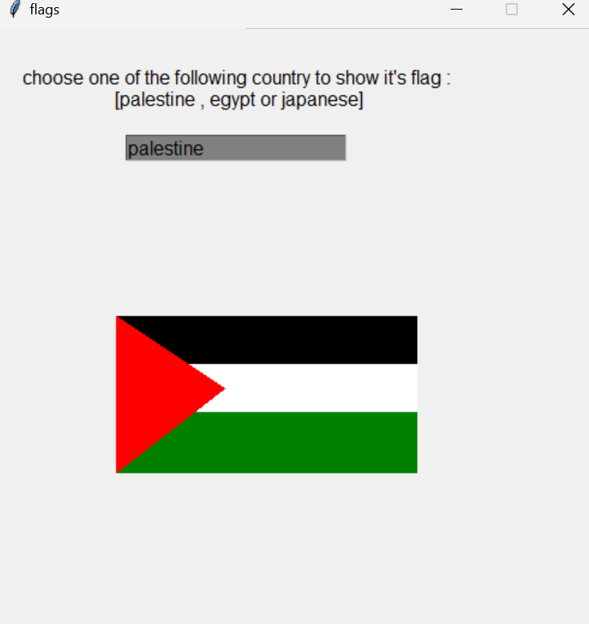
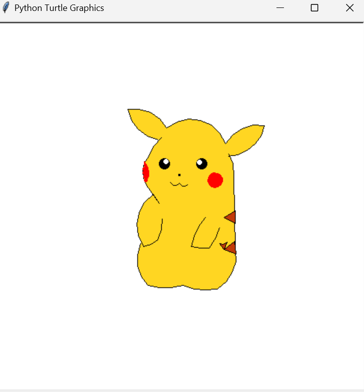
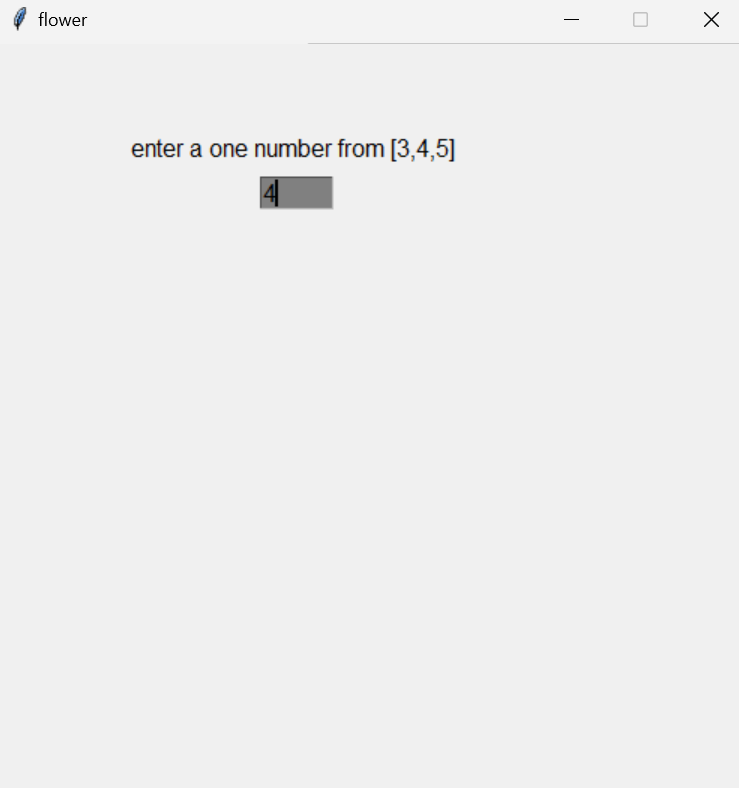
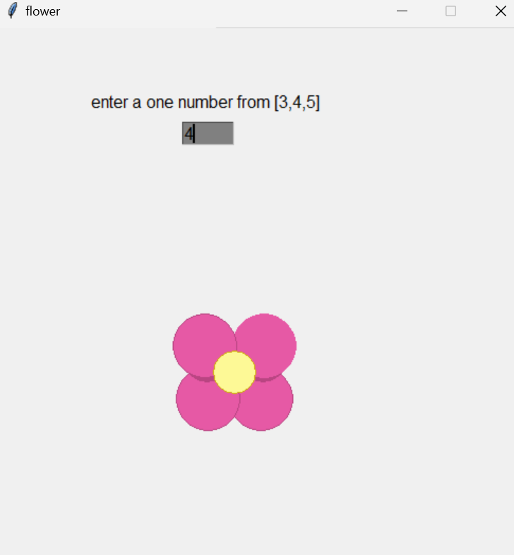

# Graphics Projects 🎨

This repository contains a collection of **Graphics** projects I developed during my university studies using **Python Turtle**.

## Projects 🚀

### 1. Flappy Bird Clone 🐦


📌 **Description**:
A simple Flappy Bird clone using Python Turtle.

📂 **Files**:
- [`flappy.py`](FlappyBirdClone/flappy.py) - Project code

---

### 2. Maze Solver 🔍


📌 **Description**:
A robot that automatically solves a maze using a pathfinding algorithm.

📂 **Files**:
- [`maze.py`](MazeSolver/maze.py) - Project code

---

### 3. Chess Board ♟️


📌 **Description**:
A chessboard drawn using Python Turtle with accurate square positioning and colors.

📂 **Files**:
- [`chess.py`](ChessBoard/chess.py) - Project code

---

### 4. Emoji Face 🙂


📌 **Description**:
A simple smiley face created using Python Turtle.

📂 **Files**:
- [`emoji.py`](EmojiFace/emoji.py) - Project code

---

### 5. Mario Character 🏃‍♂️


📌 **Description**:
A pixel-art style drawing of Mario using Python Turtle.

📂 **Files**:
- [`mario.py`](MarioBlockGame/mario.py) - Project code
- [`mario11.py`](MarioBlockGame/mario.py) - Project code

---

### 6. Snake Game 🐍


📌 **Description**:
A simple Snake game where the player controls a snake to collect food while avoiding collisions.

📂 **Files**:
- [`snake.py`](SnakeGame/snake.py) - Project code

---

### 7. Flags Collection 🚩



📌 **Description**:
Various national flags drawn using Python Turtle.

📂 **Files**:
- [`flags.py`](CountryFlags/flags.py) - Project code

---

### 8. Pikachu Drawing ⚡


📌 **Description**:
A drawing of Pikachu using Python Turtle with detailed shapes and colors.

📂 **Files**:
- [`pikachu.py`](PikachuDrawing/pikachu.py) - Project code

---

### 9. Flower with Petals 🌸



📌 **Description**:
A symmetrical flower drawn with multiple petals using loops in Python Turtle.

📂 **Files**:
- [`flower.py`](BlossomFlower/flower.py) - Project code

---

## 📌 How to Run
To run any of the projects, use:
```sh
python project_name.py
```
Replace `project_name.py` with the corresponding file name.

---

⭐ **Feel free to explore, modify, and contribute!**

